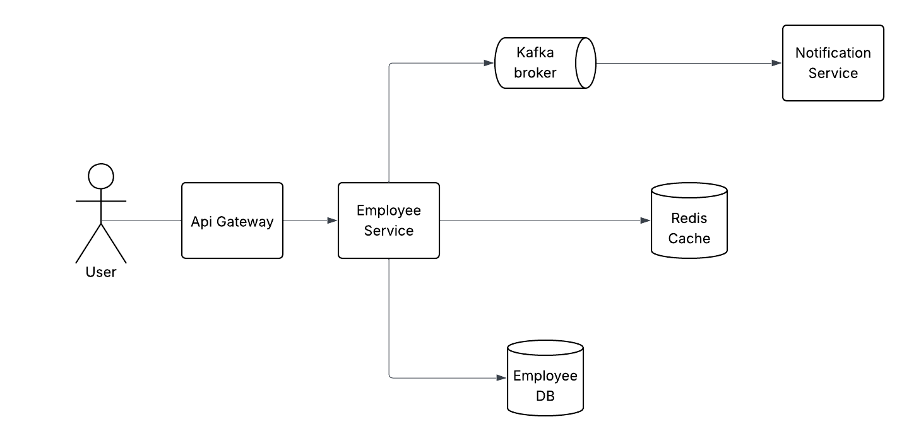

# employee-service

This project reprsents the emlpoyee service + notification service for the implementation of an HRIS system. Below, you can find the details of the system in this document.

## How to run
This project can be run completely via `docker-compose`. In the root of the project, run:

| Task                           | Description                                                          |
|--------------------------------|----------------------------------------------------------------------|
| `docker composer up --build`   | Builds the project, pulls all dependencies and runs the full project |


> [!TIP]
> If the project was not running due to unavailable ports, make sure to free up, or update the ports on `docker-compose.yml` file.

If the server starts successfully, you'll see the following output:

```
2025-11-04 14:32:45.584 [main] INFO  Application - Application started in 1.252 seconds.
2025-11-04 14:32:45.682 [main] INFO  Application - Responding at http://0.0.0.0:8080
```

After a successful start, the swagger will be available at: http://0.0.0.0:8080/openapi

> [!CAUTION]
> If ktor.environment field is set to DEV in application.yml, the Postgres DB will be switched with an in memory H2 DB. 
> Make sure to change it to DEV only for testing purposes. 

## How to run tests
This project comes with a set of integration and unit tests, which can be run via the command below:

| Task                          | Description                                       |
|-------------------------------|---------------------------------------------------|
| `./gradlew test`              | Run all integration and unit tests of the project |

___

# Design and Implementation
Here, I focus on some of the design decisions made, and some of the trade-offs of the project.

## System design



> [!NOTE]
> API Gateway has been omitted in actual implementation for simplicity

> [!NOTE]
> Notification service has been implemented in a separate package as a separate Ktor module, to reduce development time.  
> In production ready implementation, this service should be implemented in its own microservice and repository. 

The main components of this project are:

| Component            | Description                                                                                                                    |
|----------------------|--------------------------------------------------------------------------------------------------------------------------------|
| Employee service     | Handles business logics related to the HRIS system, including employee CRUD operations, event propagation and cache operations |
| Notification service | Handles notification related logics, received from Kafka topics related to employee updates                                    |
| Employee DB          | Stores employee and review data                                                                                                |
| Redis                | Performing as a cache layer                                                                                                    |

## Trade-offs

- **R2DBC vs Exposed DAO**: In its current version, Exposed DAO doesn't support R2DBC operations. This means I had to choose<br/>between DAO or R2DBC for more performance, which ultimately R2DBC was chosen.
- **Closure tables vs LTREE**: To represent hierarchy, I opted to use Closure tables, making sure the program has enough throughput for<br/>hierarchy queries. Although LTREE can be a very good solution here, ultimately due to better performance of depth calculation<br/> closure tables was chosen.
- **Flat hierarchy response vs Nested hierarchy response**: The hierarchy response for the employees are represented in a flat mode. <br/> This has been done as the system can include easily 10-20 layers of nested hierarchy, a flat representation would be more performant. 
- **Common DTO model vs Layer specific models**: For the size of the project, I didn't want to complicate the model structures<br/> too much by separating each layers' models, so I mostly rely on a common model that can be used throughout layers. For more <br/>robust implementations, models can be layer specific.
- **One vs Two Kafka topics**: I opted in to have two topics, mainly for demonstration purposes, but in systems like this, usually one topic <br/> is also accepted such as EmployeeUpdatedTopic, and parsing and deciding will be on consumers.

## Hierarchy implementation in DB
The stored hierarchy model in DB is closure table, to ensure enough throughput for our main queries. And ultimately, the results are  
bing represented in a flat JSON object. All the hierarchy and supervisor operations will also include the root to make sure callee can  
recreate the hierarchy.  
In addition to this, mechanisms should exist for scaling the db if necessary. 

## Service layer architectural pattern
The service layer architectural pattern is a simple 3 tiered architecture + repository pattern + data source pattern.  
Most abstraction layers have been omitted due to size of the project and lesser degree of complexity, but can be easily  
introduced in case of need.

| Component   | Description                                                           |
|-------------|-----------------------------------------------------------------------|
| Controller  | Presentation - Entry point to the system, mapping of input and output |
| Service     | Domain - Handles business logics                                      |
| Repository  | Data - Handles data persistence and transparent caching               |
| Data source | Data - Handles data technology specific operations                    |

## Testing strategy
Almost all important happy paths and edge cases have been tested via integration tests.  
Unit tests are also guarding against unwanted changes in classes.  
Load tests with tools like K6 and Gatling should be done on the project.

## Monitoring
Though not completely implemented in this project for time saving measures, we should ultimately be able to have the metrics below: 

### Key metrics
- Application metrics from Ktor/Micrometer (latency, traffic, errors)  
- JVM metrics
- Infra metrics such as Kafka consumer logs, redis and PostgreSQL exporter logs
- Logging coming from application with tools like call logging and logs 
- Tracing with tools like opentelemtry to be able to trace each request in a microservice environment
- Displaying all these data in their relative tools such as Graphana, Jeager, FLOG, etc...

## Future improvements
- Optimizing caching
- Introducing monitoring services, such as FLOG or Graphana with help of tools like opentelemetry
- Add CORS
- Add auth measures (Authentication and Authorization)
- Secure code (sanitizing inputs, defense against IDOR, CSRF, XSS, etc...)
- Use opentelemtry for tracing
- Introduce JavaDoc and code doc for more important sections of the code


